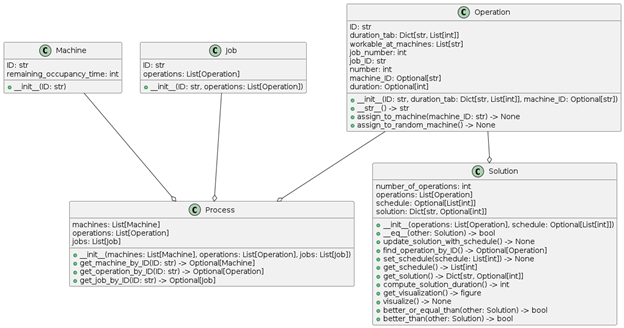
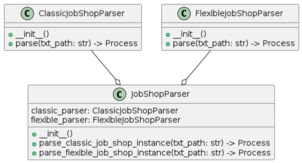
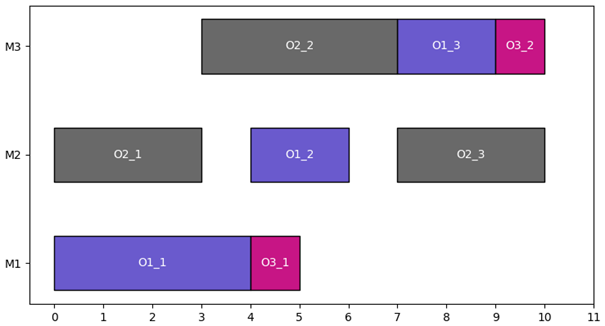
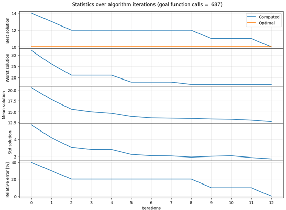
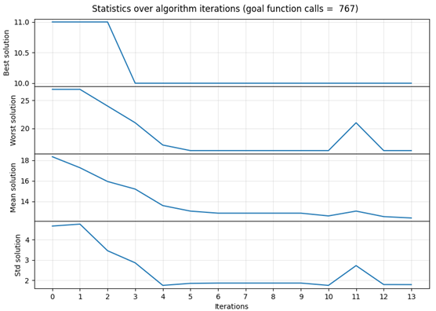

# ScheduleFinder

## Overview
ScheduleFinder is able to optimise both Job Shop Scheduling Problem and Flexible Job Shop Scheduling Problem processes. In both cases, the workflow is identical. A production process written to a text file in a standardised and commonly used form is sent to a parser, which converts it to a form acceptable to the module performing the optimisation. This module, implements a discrete variant of the artificial bee swarm algorithm created specifically for this issue. As a result of this algorithm, the found solution is returned, as well as the history of its successive iterations (best, worst, average solution per iteration, etc.).  The found solution can be visualised in the form of a Gantt chart, while the history of iterations can be used to analyse the performance of the algorithm and select appropriate parameters.

## Requirements
Having Python interpreter available run
``` bash
pip install -r requirements.txt
```
command to install all required libraries.

## Program structure
- main.py - the main program file. It is the only one to be run by the user. In the case of normal programme operation, it is used to run the algorithm looking for the best solution,
- process_model.py - a file in which the classes describing the production process and the structure defining the form of the production schedule are defined,
- instances_parser.py - file, implementing classes whose methods are used to convert input text files describing processes in a standardised form into the form of classes defined in the process_model.py file,
- schedule_finder.py - a file in which an approximation algorithm for process optimisation is implemented,
- auto_tester.py - a file, in which a function that performs automatic tests of the created algorithm was implemented,
- test_instances - a folder containing all the test instances used in this thesis, as well as a configuration file in JSON or YAML format that contains the input parameters for the function that performs the automatic tests,
- test_output - a folder where the data resulting from the experiments are saved.

The classes used to describe the production process in the programme, together with the relationships between them, are shown in the diagram below.



The classes used to load test instances are shown in the diagram below. 



## Input data
The test instances for the Job Shop Scheduling Problem were taken from [this page](http://jobshop.jjvh.nl/). It contains a very extensive collection of production processes. For each of them, there is a text file with its representation in standard form, a set of the best solutions found so far for the problem, and the value (execution time) of the best solution, which can serve as a benchmark to which the schedules determined by the algorithm created in this work will be compared. The test instances for the Flexible Job Shop Scheduling Problem were downloaded from [this page](https://openhsu.ub.hsu-hh.de/entities/publication/436). In this case, the values of the optimal solutions were taken from [this article](https://d-nb.info/1023241773/34).

## Schedule Finder parameters
A number of parameters are passed to the algorithm, which can be divided into two main groups:
- control parameters - they determine the course of the algorithm,
- stop conditions - on their basis a decision is made to stop the execution of the algorithm and return the best solution found until then.

These parameters are:
- control parameters:
  - **operations**: *List[Operation]* - list of operations that make up the production process.  Each of these has information about the machines that can perform it and the times required to do so.
  - **population_size**: *int* -  size of the population. Its value determines how many schedules will be considered during one iteration of the algorithm.
  - **limit**: *int* - This is a number that determines after how many iterations, a given solution will be abandoned if no better schedule is found in its neighbourhood.
  - **local_search_max_iter**: *int* - maximal number of neighbour solutions generated during local search.
  - **local_search_probability**: *float* - how likely local search will be performed.
  - **classic_mode**: *bool* - allows to change the way of new solutions generation. If True, machines will be randomly reassigned during new solutions creation. If False - they won't.
  - **debug_msg**: *bool* - if provided, debug messages will be printed in terminal.
- stop conditions
  - **max_iter**: *int* - the maximum number of iterations of the algorithm, after which the best solution found up to that time will be returned.
  - **stagnancy_terminate_limit**: *int* - The second is the limit of consecutive iterations of the programme without improving the best solution found.
  - **optimal_duration**: *Optional[int]* - The next parameter is the value of the optimal solution (if known). It is useful when experimenting on test instances for which the optimal schedule time is known.
  - **acceptable_relative_error**: *float* - the maximum acceptable value of the relative error (applicable only if **optimal_duration** has been provided).

All parameters are passed when creating an instance of the ScheduleFinder class, which implements the created algorithm. 
The first of the control parameters is the list of operations that make up the production process. Each of these has information about the machines that can perform it and the times required to do so. The next, is the size of the population. Its value determines how many schedules will be considered during one iteration of the algorithm. The next parameter is the so-called lifetime. This is a number that determines after how many iterations, a given solution will be abandoned if no better schedule is found in its neighbourhood. The fourth and fifth parameters (local_search_max_iter and local_search_probability) refer to additional searches of the neighbourhood of a given solution, which will be described in detail in section 3.5.7. They are the maximum number of new solutions and the probability of performing additional searches. 
The next four parameters are the stop conditions of the algorithm. The programme is interrupted when at least one of them is met. The first is the maximum number of iterations of the algorithm, after which the returned

## Program output
The most important result returned by the created algorithm is the best found solution to the scheduling problem for the transferred production process. This solution is an instance of the Solution class. It can be saved to a text file as well as visualised in the form of a Gantt chart, analogous to the one presented below.



The second element returned by the algorithm is a dictionary which is a record of some basic statistics for each iteration of the algorithm. It contains information about the best, worst and average solution, as well as the standard deviation of the solutions for each iteration. It can be visualised in the form of a set of graphs, the form of which varies slightly depending on whether an optimal solution value has been passed to the algorithm. If so, it appears in one of the graphs and a graph is added showing the relative error of the best solution at each epoch. In addition, the number of calls to the objective function, which in this paper serves as one measure of algorithm evaluation, is included in the graph title.



